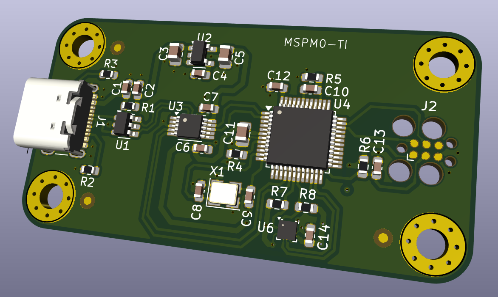
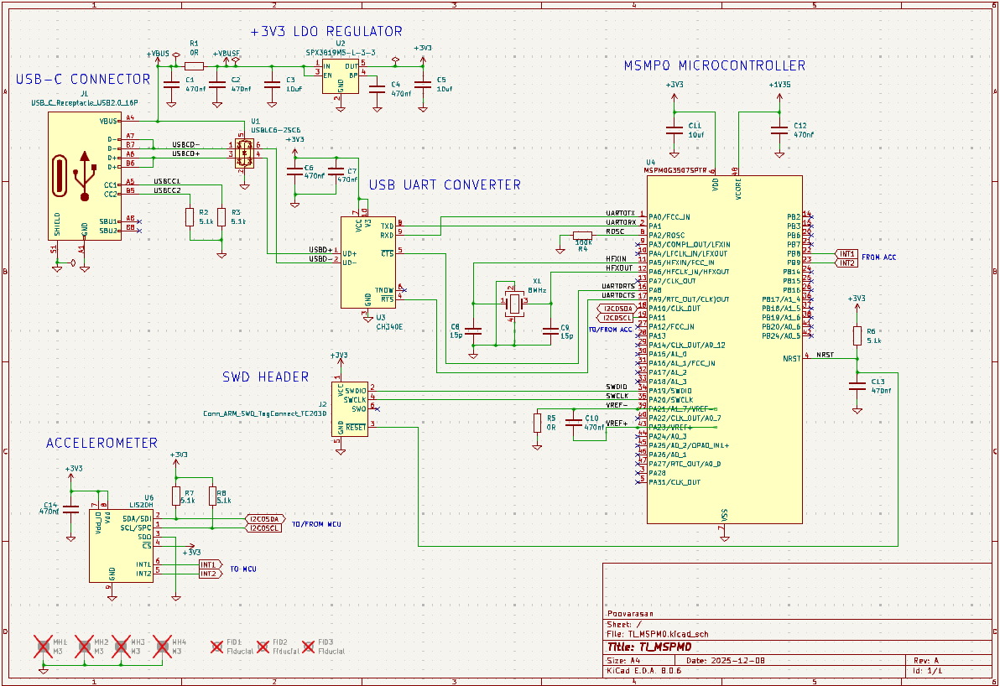
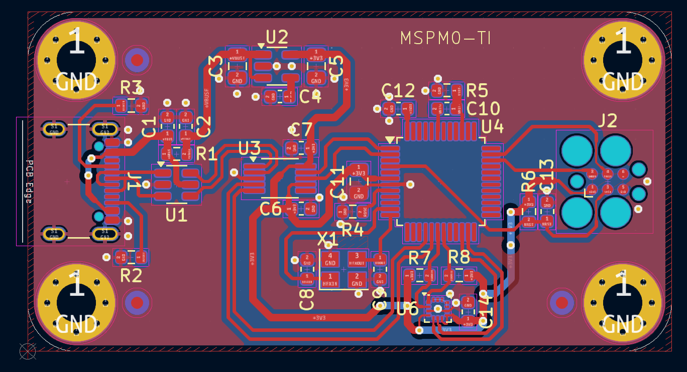

# MSPM0G3507SPTR-dev-board

A custom hardware development board for the Texas Instruments **MSPM0G3507** (Arm Cortex-M0+) microcontroller. This project was designed in **KiCad 8** following professional hardware design methodologies.

## 📝 Project Overview
This board is designed as a compact, general-purpose evaluation platform. It features USB-C connectivity for power and data, a high-precision LDO, and an onboard MEMS accelerometer for motion sensing applications.

### Key Features
* **MCU:** TI MSPM0G3507 (Arm Cortex-M0+, 80MHz, 128KB Flash)
* **Sensors:** LIS2DH12 3-Axis Accelerometer (SPI/I2C)
* **Power:** 3.3V LDO (SPX3819) via USB-C
* **Debug:** Tag-Connect TC2030 Footprint (SWD)
* **Connectivity:** USB-to-UART bridge (CH340E)

---

## 🔧 Hardware Design

### Schematic
The design features a comprehensive power management stage and signal routing for the MSPM0G3507.

### PCB Layout
The board is a 2-layer stackup with careful attention to differential pair routing for USB and clean ground return paths.

---

## 📂 Component Datasheets
Below are the official datasheets and technical references used in this design:

| Component | Part Number | Description | Link |
| :--- | :--- | :--- | :--- |
| **Microcontroller** | MSPM0G3507 | TI Arm Cortex-M0+ MCU | [Datasheet](https://www.ti.com/product/MSPM0G3507/part-details/MSPM0G3507SPTR) |
| **Accelerometer** | LIS2DH12 | Ultra-low-power 3-axis MEMS | [Datasheet](https://www.st.com/resource/en/datasheet/lis2dh12.pdf) |
| **LDO Regulator** | SPX3819 | 500mA Low Dropout Voltage Regulator | [Datasheet](https://www.digikey.in/en/products/detail/maxlinear-inc/SPX3819M5-L-3-3-TR/2472394) |
| **Debug Connector**| TC2030-IDC | Plug-of-Nails™ Cable | [Datasheet](https://www.tag-connect.com/wp-content/uploads/bsk-pdf-manager/2019/12/TC2030-IDC-Datasheet-Rev-B.pdf) |

### 📚 Design References
* **Oscillator Layout:** [ST AN2867 - Oscillator Design Guide](https://www.st.com/resource/en/application_note/an2867-oscillator-design-guide-for-stm8afals-stm32-mcus-and-mpus-stmicroelectronics.pdf)

## 🚀 Getting Started
1.  Clone the repository.
2.  Open the project files in **KiCad 8.0** (or later).
3.  Review the schematic and BOM before ordering.

##  CREDITS
* Design inspired by tutorials from **Phil's Lab**.
